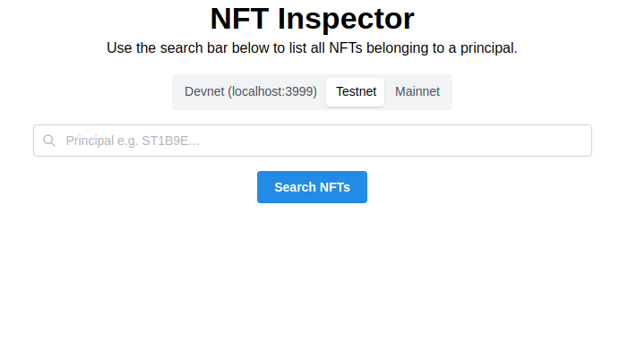

# Stacks Code Challenge

Thank you for taking the time to review this code challenge.

## Quick start

To get a development version of the app running on your local machine, use

```bash
yarn && yarn dev
```

The app has been built using Node.js v18.7.0 and Yarn 1.22.19, although it should work with recent versions of Node.js and a recent version of Yarn 1.

If all goes well, you'll see a link to the app in the console. The app should look like this,



Tests can be run with `yarn test:unit`, and the entire pipeline checks with `yarn ci`.

# Architecture

The app has been bootstrapped using Vite's Typescript template,

```bash
yarn create vite --template ts-react
```

which conveniently handles code bundling and application serving.

## Components

To speed up development, this MVP uses [Mantine](https://mantine.dev/pages/getting-started/). It is a lightweight component library with basic components, ideal for MVPs.

## Networking

This app uses `@stacks/blockchain-api-client` to fetch data from the Stacks API. It is used in conjunction with `@tanstack/react-query` which facilitates handling the request lifecycle.

## Testing

Unit testing is set up with Jest. Although a project of this scale barely benefits from using `swc` for transpiling Typescript used by Jest, it takes a couple of minutes to set up and saves a considerable amount of time as projects grow.

## Code quality

Code quality tools provide a great deal of configuration flexibility. Keeping it simple and sticking to the recommended settings usually provides most benefits for time spent.

- ESLint - using mostly default settings and `*recommended` packages. Ensures a minimum level of code quality.
- Prettier - using default settings. Ensures consistent formatting

## CI/CD workflow

The repo is configured with Github actions. Before a PR can be merged, all checks must pass. The four checks that are configured are linting, formatting, type checking, and testing.

New commits can only be added to the tip of `main` and no merge commits with more than one parent are allowed. This ensures a linear history, which allows easy reasoning of when changes were introduced and how they affected the code.

Commits may only be added to main from branches based on the current tip of `main`. This avoids race conditions where a newly merged commit breaks code from a PR with passing tests that hasn't yet been merged.

## File structure

Although there aren't many files in this repo, the broader pattern I usually follow is to group app files into a hierarchy of pages, components, providers, utils, types, and other file types depending on the project.

- Pages - only contain routing-related components. Pages may import other components to render for each of the routes.
- Components - custom-made components.
- Providers - React providers. For state management at any scale. Typically projects may have a top level component with several providers (Auth, Theming/CSS, Networking)
- Utils - helper functions. These should all have unit tests.
- Types - for Typescript types.

Any of these may be a file, a folder, or a nested hierarchy of folders with an `index.*` file, depending on the amount of code they contain. Each folder should contain files with imports used within it's import hierarchy.

## State management

The two main sources of application state are the form where the user inputs the principal address and the network calls.

Each uses a library which greatly simplifies state management,

- Form state - provided by [`@mantine/form`](https://mantine.dev/form/use-form/), which closely follows [Formik's API](https://formik.org/docs/api/formik) for managing forms. It tracks input values, errors, validation, and form submission states.
- Network calls state - provided by [`@tanstack/react-query`](https://tanstack.com/query/v4/docs/overview). It exposes a plethora of information, such as loading, error, and response data associated with a request, automatic retries, and a global query cache.

# Misc

- To fetch a principal's NFTs, this project uses the [`balances`](https://docs.hiro.so/api#tag/Accounts/operation/get_account_balance) endpoint, rather than the NFT [`holdings`](https://docs.hiro.so/api#tag/Non-Fungible-Tokens/operation/get_nft_holdings) endpoint. This is because during development there was a block storm on the tBTC network which affected Stacks' testnet, and I was unable to pull funds from the faucet or create NFTs of my own to practice during development. Nevertheless, I was able to get a devnet running on local, but unfortunately the `holdrings` endpoint doesn't appear to work when running the devnet locally.
- A very crude principal address validation function is used in this project: it only checks to make sure the address is 41 characters long. It is mostly to illustrate client-side validation and unit testing. I wasn't able to find an "official" address validation function.
